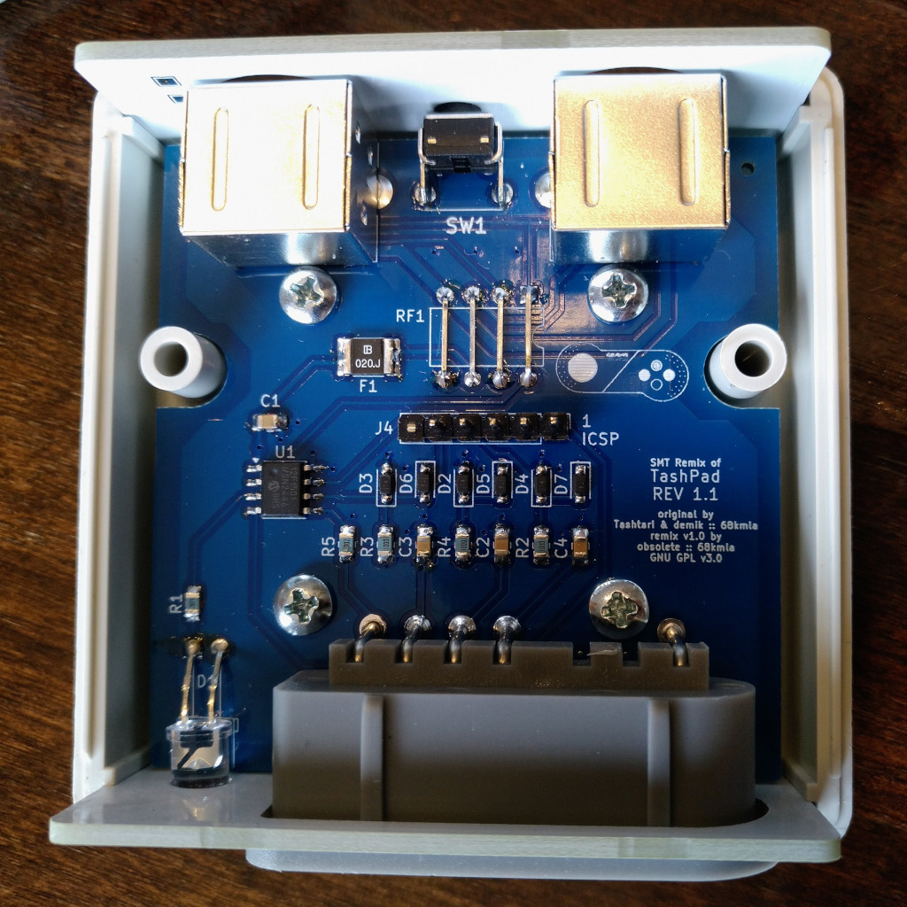

# TashPad

This is a remix of the original tashpad PCB design. The changes in this version are:

- The through-hole capacitors, resistors, diodes, and PTC fuse have been replaced with SMT parts
- The PIC12F1501 has been changed from a DIP to a SOIC package
- An ICSP connector has been added for easily writing firmware to the PIC

The component sizes and spacing have been chosen to allow relatively easy hand assembly for anyone comfortable with SMT soldering. Most of the components are only there for RF and short protection (inspired from both old Macs and the SNES itself)

This folder (pcb-smt) contains the source KiCad files for the SMT remix version of the main board. Please check the Panels subfolder of the main pcb folder for the FR-4 front and back plates. Don't forget to order these at the same time as the main board!



## BOM
### Mandatory
Here is the BOM for the main board. Part numbers are what was tested on prototype boards but there are many alternatives that can also work

| Reference(s)          | Value      | Quantity | Notes                                    | Part number               |
|-----------------------|------------|----------|------------------------------------------|---------------------------|
| C1                    | 100nF      | 1        | ceramic capacitor 0805 (2012 Metric)     | Samsung CL21B104KBCNFNC   |
| C2, C3, C4            | 330pF      | 3        | ceramic capacitor 0805 (2012 Metric)     | Samsung CL21B331KBANNNC   |
| D1                    | Green      | 1        | 5mm any color 20 mA LED                  | Kingbright L-53SGD        |
| D2 to D7              | 1N4148     | 6        | general purpose switching diode SOD-323F | Diotec 1N4148WS           |
| F1                    | 200mA Fuse | 1        | PPTC resettable fuse 1812 (4532 Metric)  | Yageo SMD1812B020TF-J     |
| J1, J2                | Connector  | 2        | Mini DIN-4 (S-Video / ADB)               | TE 5749181-1              |
| J3                    | Connector  | 1        | SNES Angled (90°) connector              | ??? right gray one        |
| R2, R3, R4            | 100Ω       | 3        | thick film resistor 0805 (2012 metric)   | KOA Speer RK73H2ATTD1000F |
| R1                    | 330Ω       | 1        | thick film resistor 0805 (2012 metric)   | KOA Speer RK73H2ATTD3300F |
| R5                    | 10kΩ       | 1        | thick film resistor 0805 (2012 metric)   | KOA Speer RK73H2ATTD1002F |
| SW1                   | SPST       | 1        | right angle SPST switch                  | TE FSMRA4JH04             |
| U1                    | PIC        | 1        | 8-bit Microcontroller 8-SOIC PIC12F1501  | Microchip PIC12F1501-I/SN |
| J4                    | ICSP       | 1        | ICSP Connector (pin header)              | Adam Tech PH1-06-UA       |
| Case                  | ABS        | 1        | Instrument Case, ABS 2.6x2.6"            | HM 1593K(TBU\|GY\|BK)     |
| PCB Screws            | #4         | 4        | Phillips Pan Head screws #4 x 1/4"       | SERPAC 6004               |

### Optional

| Reference(s)          | Value      | Quantity | Notes                                    | Part number               |
|-----------------------|------------|----------|------------------------------------------|---------------------------|
| RF1                   | 1:1:1:1    | 1        | common mode chokes / filters             | HALO LD11-0246FLF         |
| R1                    | 2.4kΩ      | 1        | thick film resistor 0805 (2012 metric)   | KOA Speer RK73H2ATTD2871F |
| D1                    | Blue       | 1        | High efficiency 4000-8000mcd 5mm LED     | Cree C503B-ABN-CW0Z0251   |

:information_source: The common choke is recommended but pricey (about $5). When building without one, you need to bridge the holes with wires as shown on the PCB

R1 + D1 combo replaces the 300Ω + 20mA LED combo with a high efficiency LED which will be run with only 1mA. This puts less load on the ADB bus and is the recommended choice

### BOM (external links)
Here is a complete DigiKey cart (except the SNES connector).
- https://www.digikey.com/short/2qfqpwfb
Note that quantities in this cart are for 5 PCBAs, and it uses the optional high-efficiency LED and resistor combo. DigiKey does not stock the HALO common mode choke, and there is no known substitute.

## PCBs
The PCBs are simple 2-layer boards. The gerbers are available in the release section.
Check for the following files:
* TashPad_1.1.zip: main board revision 1.1
* TashPad_back_panel_1.1.zip: FR-4 back panel revision 1.1
* TashPad_front_panel_1.0.zip: FR-4 back panel revision 1.0

You should be able to use any mainstream PCB manufacturer for these. Nothing special about them. PCB thickness should be 1.6mm

On JLCPCB, select "Specify a location" to the option "Remove Order Number" for all of them

## Building
Building is straightforward. It's recommended to start with SMT components first, then through-hole components, beginning in the center of the board and working outward toward the edges.

:warning: Please note that you MUST solder the SNES connector with the front panel in position at the same time! Otherwise you will not be able to mount the front panel

As a test run, you can run TashPad without the PIC installed. ADB Passthrough should work, and you will be able to check that the PIC power rails are OK. This should avoid damaging the PIC or other stuff if something is wrong

Power pins location:

```
                  .--------.
             +5V -|01 \/ 08|- Ground
                 -|02    07|-
                 -|03    06|-
                 -|04    05|-
                  '--------'
```
